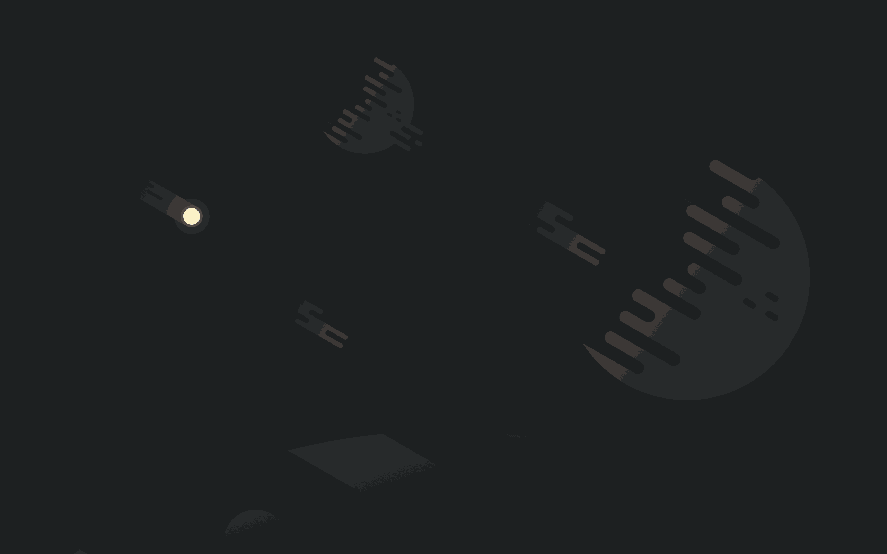
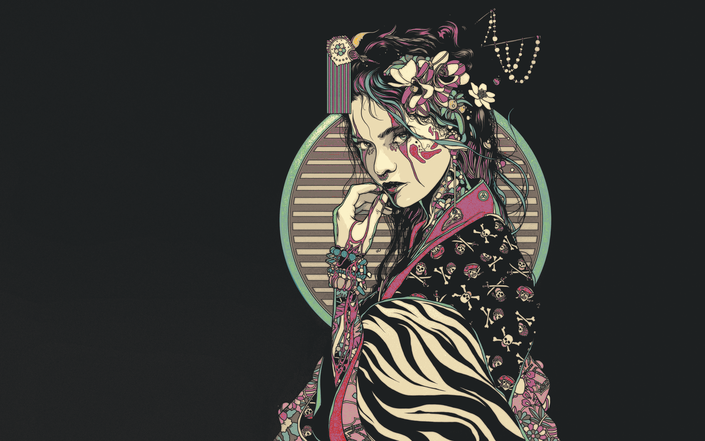
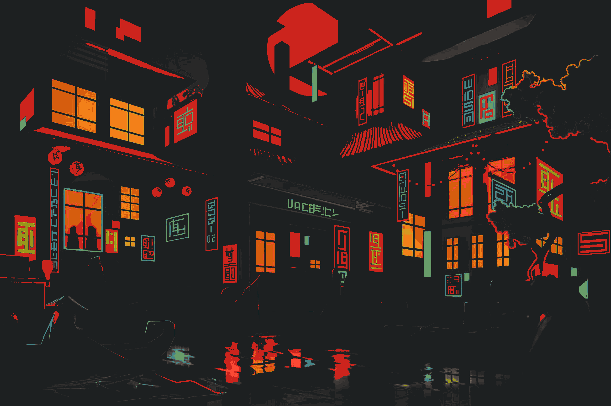
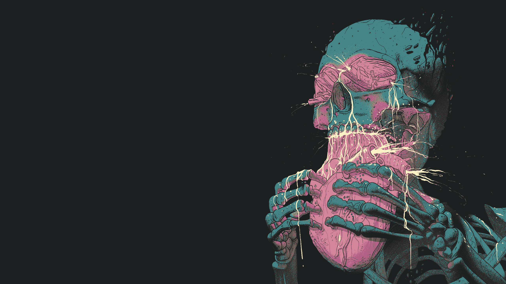

# Gruvbox Dots

Hyprland + Waybar setup with a Gruvbox dark theme.

---

## Wallpapers

| | |
|---|---|
|  |  |
|  |  |

---

## Installer script
In order to install the dots,
run these commands:
```
git clone https://github.com/syyy10/gruvbox-hypr
cd gruvbox-hypr
./install.sh
```
Then just login to hyprland and your ready.


## Structure

```
~/.config/
├── hypr/
│   ├── hyprland.conf
│   ├── hyprlock.conf
│   ├── hypridle.conf
│   ├── lock.sh
│   ├── wallpaper.sh
│   ├── powermenu.sh
│   └── wallpapers/
├── waybar/
│   ├── config
│   └── style.css
├── kitty/
│   └── kitty.conf
└── fish/
    └── config.fish
```

---

## Dependencies

| Tool | Purpose |
|---|---|
| `hyprland` | Wayland compositor |
| `hyprlock` | Screen locker |
| `hypridle` | Idle daemon |
| `swww` | Wallpaper with transitions |
| `waybar` | Status bar |
| `rofi-wayland` | App launcher / menus |
| `brightnessctl` | Brightness control |
| `wireplumber` / `wpctl` | Audio control |
| `pavucontrol` | Audio GUI |
| `nm-connection-editor` | Network GUI |
| `blueman` | Bluetooth GUI |
| `imagemagick` | Wallpaper thumbnails |
| `libnotify` | Desktop notifications |
| `fastfetch` | System info on shell open |
| `kitty` | Terminal emulator |
| `fish` | Shell |

---

## Hyprland

Config lives at `~/.config/hypr/hyprland.conf`.

**Autostart**

```ini
exec-once = swww-daemon
exec-once = waybar
exec-once = hypridle
```

**Keybinds**

| Bind | Action |
|---|---|
| `SUPER + L` | Lock screen |
| `SUPER + W` | Wallpaper picker |

**Keyboard layout** — set in the `input` block:

```ini
input {
    kb_layout = us
}
```

---

## hyprlock

Config at `~/.config/hypr/hyprlock.conf`. Blurs the current wallpaper from `~/.cache/current_wallpaper` and shows a centered clock, date, and password input field in Gruvbox colors.

The date label uses `cmd[update:60000]` syntax to run a shell command and refresh every 60 seconds:

```
text = cmd[update:60000] date +"%A, %d %B %Y"
```

If the wallpaper cache file doesn't exist yet, set `path` to a direct image path as a fallback.

---

## hypridle

Config at `~/.config/hypr/hypridle.conf`.

| Timeout | Action |
|---|---|
| 10 min | Lock screen via `lock.sh` |
| 11 min | Turn display off |
| Resume | Turn display back on |

Also locks immediately before the system sleeps via `before_sleep_cmd`.

---

## lock.sh

Runs `hyprlock`. Guards against duplicate instances with `pgrep` so hitting the bind twice won't stack lockers.

---

## wallpaper.sh

Opens a rofi grid showing thumbnails of every image in `~/.config/hypr/wallpapers/`. Selecting one sets it via `swww` with a wipe transition and writes the path to `~/.cache/current_wallpaper`.

To restore the last wallpaper on login:

```ini
exec-once = swww-daemon && swww img $(cat ~/.cache/current_wallpaper 2>/dev/null || echo "")
```

Supported formats: `jpg`, `jpeg`, `png`, `webp`, `gif`.

---

## powermenu.sh

Rofi menu with lock, suspend, reboot, shutdown, and logout options. Triggered by the `⏻` button on the right end of Waybar.

---

## Waybar

Config at `~/.config/waybar/config`, styles at `~/.config/waybar/style.css`.

The bar is a floating dock — it doesn't span the full width. Adjust the margins in `config` to resize:

```json
"margin-left": 80,
"margin-right": 80
```

**Modules**

| Module | Details |
|---|---|
| Workspaces | Hyprland workspace switcher |
| Clock | Date + time, calendar tooltip |
| CPU | Usage %, warns at threshold |
| Memory | Used GB, warns at threshold |
| Backlight | Brightness %, scroll to adjust |
| Audio | Volume %, scroll to adjust, click for `pavucontrol` |
| Network | Wi-Fi SSID or ethernet, click for `nm-connection-editor` |
| Bluetooth | Status + connected device, click for `blueman-manager` |
| Battery | Capacity %, charging state, blinks red when critical |
| Tray | System tray icons |
| Power | Opens `powermenu.sh` |

---

## Kitty

Config at `~/.config/kitty/kitty.conf`. Gruvbox dark colors with 0.8 background opacity. Opacity requires a compositor to render correctly.

Change the font family to any installed Nerd Font for glyph support:

```
font_family JetBrains Mono Nerd Font
```

---

## Fish

Config at `~/.config/fish/config.fish`. Runs `fastfetch` on every interactive shell open.
